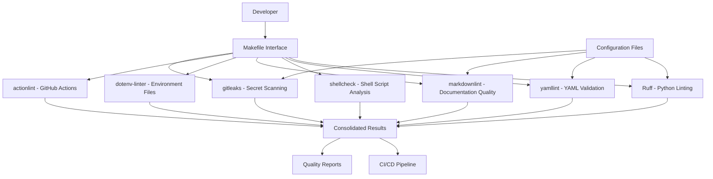
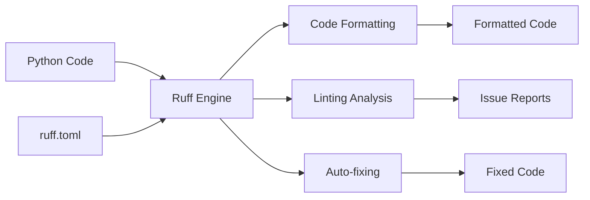
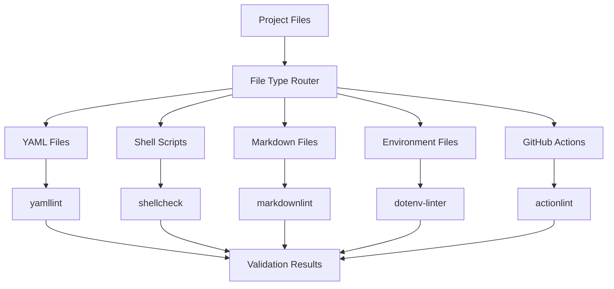
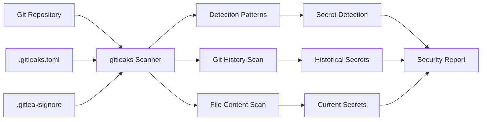
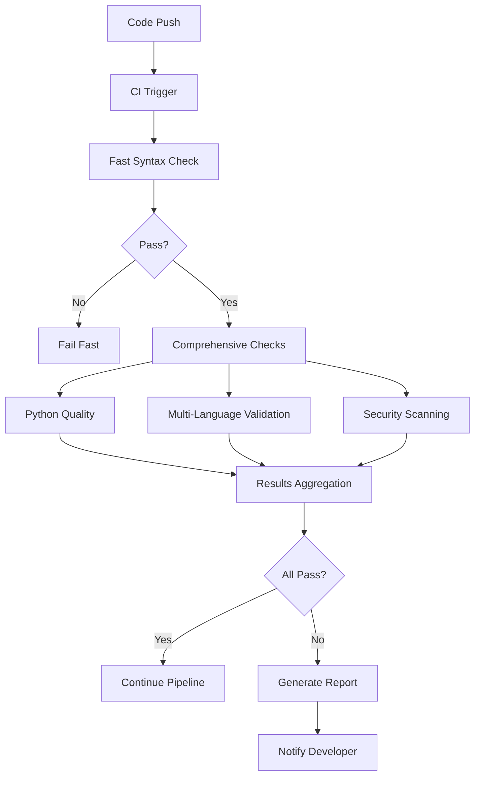
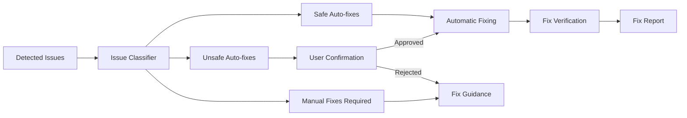

# Design Document

## Overview

This design document outlines the architecture and implementation approach for a comprehensive linting and code quality system for the Discord bot project. The system integrates multiple specialized linting tools through a unified interface, providing fast, comprehensive code quality checks with automated fixing capabilities.

## Architecture

### High-Level Architecture



### Tool Selection Rationale

| Tool | Purpose | Why Chosen | Replaces |
|------|---------|------------|----------|
| **Ruff** | Python linting/formatting | 10-100x faster, 174+ rules, modern Python | black, isort, flake8 |
| **yamllint** | YAML validation | Industry standard, comprehensive rules | Manual validation |
| **shellcheck** | Shell script analysis | Security-focused, catches common errors | Manual review |
| **markdownlint** | Documentation quality | Consistent formatting, readability | Manual formatting |
| **dotenv-linter** | Environment file validation | Prevents configuration errors | Manual validation |
| **actionlint** | GitHub Actions validation | Workflow-specific rules, prevents CI failures | Manual validation |
| **gitleaks** | Secret detection | Git-aware, fast, comprehensive patterns | detect-secrets |

## Components and Interfaces

### 1. Makefile Interface Layer

**Purpose:** Provides unified commands for all linting operations

**Key Commands:**
```makefile
# Primary commands
make lint           # Run all linting tools
make format         # Format code with modern tools
make check-all      # Comprehensive quality checks
make check-ci       # Fast CI-critical checks

# Specialized commands
make lint-python    # Python-only linting
make format-legacy  # Backward compatibility
make check-security # Security-focused scanning
```

**Design Decisions:**
- Single entry point for all quality checks
- Parallel execution where possible
- Clear error reporting with actionable messages
- Graceful degradation when tools are missing

### 2. Configuration Management System

**Purpose:** Centralized, maintainable configuration for all tools

**Configuration Files:**
```
ruff.toml              # Ruff configuration
.yamllint.yml          # YAML linting rules
.markdownlint.yml      # Markdown formatting rules
.gitleaks.toml         # Secret detection patterns
.gitleaksignore        # Secret detection exclusions
```

**Design Principles:**
- Tool-specific configuration files for clarity
- Consistent rule philosophy across tools
- Environment-specific overrides where needed
- Self-documenting configuration with comments

### 3. Python Quality System (Ruff)

**Purpose:** Modern, fast Python code quality enforcement

**Architecture:**


**Key Features:**
- 174+ linting rules covering security, performance, style
- Automatic code formatting (Black-compatible)
- Import sorting (isort-compatible)
- Auto-fixing for 60+ rule types
- Modern Python feature detection (type hints, f-strings)

**Configuration Strategy:**
- Line length: 88 characters (Black compatibility)
- Target Python 3.11+ features
- Security rules enabled by default
- Test-specific rule relaxation
- Performance optimization suggestions

### 4. Multi-Language Validation System

**Purpose:** Comprehensive validation for all project file types

**Component Architecture:**


**Validation Rules:**
- **YAML:** Syntax, indentation, line length, key ordering
- **Shell:** Security vulnerabilities, quoting, best practices
- **Markdown:** Formatting consistency, link validation, heading structure
- **Environment:** Syntax validation, common mistake detection
- **GitHub Actions:** Workflow syntax, action version validation

### 5. Security Scanning System

**Purpose:** Comprehensive security analysis and secret detection

**Architecture:**


**Security Features:**
- Discord bot token detection
- Database connection string scanning
- API key and webhook URL detection
- Custom pattern matching
- Git history analysis
- False positive management

### 6. CI/CD Integration System

**Purpose:** Seamless integration with continuous integration pipelines

**Integration Architecture:**


**CI/CD Features:**
- Fast-fail on critical syntax errors
- Parallel execution of independent checks
- Comprehensive reporting with fix suggestions
- Integration with GitHub Actions
- Cost optimization through smart caching

### 7. Auto-fixing System

**Purpose:** Automated resolution of common code quality issues

**Auto-fix Architecture:**


**Auto-fix Categories:**
- **Safe:** Formatting, import sorting, simple syntax fixes
- **Unsafe:** Logic changes, type hint additions, complex refactoring
- **Manual:** Architecture changes, security fixes, business logic

## Data Models

### Configuration Model

```python
@dataclass
class LintingConfig:
    """Central configuration for all linting tools."""

    # Tool enablement
    enabled_tools: Set[str]

    # Python-specific settings
    python_target_version: str
    line_length: int
    auto_fix_enabled: bool
    unsafe_fixes_enabled: bool

    # File patterns
    include_patterns: List[str]
    exclude_patterns: List[str]

    # CI/CD settings
    fail_on_error: bool
    parallel_execution: bool

    # Reporting
    output_format: str
    verbose_output: bool
```

### Results Model

```python
@dataclass
class LintingResult:
    """Standardized result format for all linting tools."""

    tool_name: str
    file_path: str
    line_number: Optional[int]
    column_number: Optional[int]

    severity: Literal["error", "warning", "info"]
    rule_code: str
    message: str

    auto_fixable: bool
    fix_suggestion: Optional[str]

    context_lines: List[str]

@dataclass
class LintingSummary:
    """Aggregated results from all linting tools."""

    total_files_checked: int
    total_issues_found: int
    issues_by_severity: Dict[str, int]
    issues_by_tool: Dict[str, int]

    auto_fixes_applied: int
    manual_fixes_required: int

    execution_time: float
    success: bool
```

## Error Handling

### Error Categories and Responses

1. **Tool Installation Errors**
   - Detection: Check tool availability before execution
   - Response: Provide installation instructions, graceful degradation
   - Example: "shellcheck not found. Install with: brew install shellcheck"

2. **Configuration Errors**
   - Detection: Validate configuration files on startup
   - Response: Clear error messages with fix suggestions
   - Example: "Invalid ruff.toml: line 15 - unknown rule 'XYZ123'"

3. **File Processing Errors**
   - Detection: Handle file access and parsing errors
   - Response: Skip problematic files, report issues
   - Example: "Cannot read file.py: Permission denied"

4. **Performance Issues**
   - Detection: Monitor execution time and resource usage
   - Response: Provide performance warnings and optimization suggestions
   - Example: "Linting took 30s. Consider excluding large generated files"

### Error Recovery Strategies

```python
class LintingOrchestrator:
    """Manages error handling and recovery for linting operations."""

    def handle_tool_failure(self, tool: str, error: Exception) -> None:
        """Handle individual tool failures gracefully."""
        if tool in self.critical_tools:
            raise LintingError(f"Critical tool {tool} failed: {error}")
        else:
            self.logger.warning(f"Non-critical tool {tool} failed: {error}")
            self.disabled_tools.add(tool)

    def validate_environment(self) -> List[str]:
        """Validate that required tools are available."""
        missing_tools = []
        for tool in self.required_tools:
            if not self.is_tool_available(tool):
                missing_tools.append(tool)
        return missing_tools
```

## Testing Strategy

### Unit Testing

**Scope:** Individual tool integrations and configuration parsing

**Test Categories:**
- Configuration validation tests
- Tool execution wrapper tests
- Result parsing and aggregation tests
- Error handling and recovery tests

**Example Test Structure:**
```python
class TestRuffIntegration:
    def test_ruff_execution_success(self):
        """Test successful ruff execution with valid Python code."""

    def test_ruff_auto_fix_application(self):
        """Test that auto-fixes are applied correctly."""

    def test_ruff_configuration_loading(self):
        """Test that ruff.toml is loaded and applied correctly."""

    def test_ruff_error_handling(self):
        """Test handling of ruff execution errors."""
```

### Integration Testing

**Scope:** End-to-end workflow testing with real project files

**Test Scenarios:**
- Complete linting workflow execution
- CI/CD pipeline integration
- Multi-tool coordination and result aggregation
- Performance benchmarking

### Performance Testing

**Scope:** Execution time and resource usage validation

**Benchmarks:**
- Ruff vs. legacy tools (black/isort/flake8) performance comparison
- Parallel vs. sequential execution timing
- Large codebase handling (1000+ files)
- CI/CD pipeline execution time

### Compatibility Testing

**Scope:** Tool version compatibility and upgrade path validation

**Test Matrix:**
- Python versions (3.11, 3.12, 3.13)
- Tool versions (current and previous major versions)
- Operating systems (macOS, Linux, Windows)
- CI/CD environments (GitHub Actions, GitLab CI)

## Implementation Phases

### Phase 1: Core Python Quality System
- Ruff integration and configuration
- Makefile command structure
- Basic auto-fixing capabilities
- CI/CD integration for Python files

### Phase 2: Multi-Language Validation
- YAML, shell script, and Markdown validation
- Environment file and GitHub Actions checking
- Unified reporting system
- Error handling and recovery

### Phase 3: Security and Advanced Features
- Gitleaks integration and secret scanning
- Advanced auto-fixing with user confirmation
- Performance optimization and parallel execution
- Comprehensive reporting and metrics

### Phase 4: Developer Experience Enhancement
- IDE integration guidance
- Pre-commit hook setup
- Documentation and training materials
- Legacy migration tools and guides

## Performance Considerations

### Optimization Strategies

1. **Parallel Execution**
   - Run independent tools simultaneously
   - Use process pools for file-level parallelism
   - Implement smart scheduling based on tool execution time

2. **Incremental Analysis**
   - Only analyze changed files when possible
   - Cache results for unchanged files
   - Use Git diff to determine scope

3. **Smart Tool Selection**
   - Skip tools when file types don't match
   - Use fast tools for CI critical path
   - Defer comprehensive checks to background processes

4. **Resource Management**
   - Monitor memory usage for large codebases
   - Implement timeout mechanisms for long-running tools
   - Provide resource usage reporting

### Performance Targets

- **Python linting:** 10-100x faster than legacy tools
- **CI execution:** Complete in under 2 minutes for typical changes
- **Memory usage:** Stay under 1GB for large codebases
- **Startup time:** Tool initialization under 5 seconds

## Security Considerations

### Secret Detection Strategy

1. **Pattern-Based Detection**
   - Discord bot tokens, API keys, database URLs
   - Custom patterns for project-specific secrets
   - Entropy-based detection for unknown patterns

2. **Git History Scanning**
   - Full repository history analysis
   - Commit-by-commit secret detection
   - Historical secret rotation recommendations

3. **False Positive Management**
   - Allowlist for known safe patterns
   - Context-aware detection (test files, documentation)
   - User-friendly exclusion mechanisms

### Security Best Practices Enforcement

1. **Code Analysis**
   - SQL injection prevention patterns
   - Input validation requirements
   - Secure coding practice enforcement

2. **Configuration Security**
   - Insecure default detection
   - Permission and access control validation
   - Encryption and hashing requirement enforcement

3. **Dependency Security**
   - Known vulnerability detection
   - Outdated dependency identification
   - Security update recommendations

This design provides a comprehensive, scalable, and maintainable approach to code quality enforcement while maintaining developer productivity and system performance.
