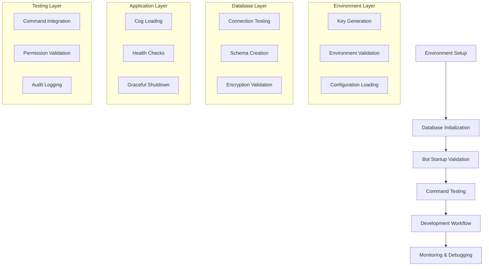

# Design Document

## Overview

The foundation completion design addresses the remaining infrastructure gaps in the Discord moderation bot to ensure reliable, production-ready operation. The design builds upon the existing strong foundation including database layer, development environment, code quality tools, and bot architecture. The solution focuses on completing environment configuration, database initialization, startup validation, command testing, development workflow optimization, and monitoring capabilities.

## Architecture

### Current Architecture Strengths
- **Layered Architecture**: Clear separation between cogs (presentation), services (business logic), and models (data)
- **Configuration Management**: Environment-based configuration with `config.py` and `.env` files
- **Database Layer**: SQLAlchemy ORM with encryption support and connection management
- **Bot Framework**: Discord.py with cog-based modular architecture
- **Development Tools**: Comprehensive Makefile, Docker setup, and automated workflows

### Foundation Completion Components



## Components and Interfaces

### 1. Environment & Secrets Management Component

**Purpose**: Ensure proper encryption keys and environment configuration across all environments.

**Key Classes**:
- `EnvironmentValidator`: Validates required environment variables
- `KeyGenerator`: Generates secure encryption keys
- `ConfigurationManager`: Enhanced configuration loading with validation

**Interfaces**:
```python
class EnvironmentValidator:
    def validate_encryption_keys(self) -> bool
    def validate_database_config(self) -> bool
    def validate_discord_config(self) -> bool
    def generate_missing_keys(self) -> Dict[str, str]

class KeyGenerator:
    def generate_encryption_key(self) -> str
    def generate_salt_key(self) -> str
    def generate_pepper_key(self) -> str
    def validate_key_format(self, key: str) -> bool
```

### 2. Database Initialization Component

**Purpose**: Ensure reliable database setup and validation across environments.

**Enhanced Classes**:
- `DatabaseInitializer`: Comprehensive database setup and validation
- `EncryptionTester`: End-to-end encryption/decryption testing
- `ConnectionValidator`: Multi-environment connection testing

**Interfaces**:
```python
class DatabaseInitializer:
    def initialize_schema(self) -> bool
    def test_connections(self) -> Dict[str, bool]
    def validate_encryption_flow(self) -> bool
    def run_health_checks(self) -> HealthStatus

class EncryptionTester:
    def test_encrypt_decrypt_cycle(self, data: str) -> bool
    def validate_key_derivation(self) -> bool
    def test_database_encryption(self) -> bool
```

### 3. Bot Startup Validation Component

**Purpose**: Ensure reliable bot startup with comprehensive validation and error handling.

**Enhanced Classes**:
- `StartupValidator`: Validates all startup requirements
- `CogManager`: Enhanced cog loading with detailed error reporting
- `HealthMonitor`: Comprehensive health checking system

**Interfaces**:
```python
class StartupValidator:
    def validate_prerequisites(self) -> ValidationResult
    def validate_permissions(self) -> PermissionStatus
    def validate_channels(self) -> ChannelStatus
    def perform_startup_tests(self) -> StartupStatus

class CogManager:
    def load_cogs_with_validation(self) -> Dict[str, LoadStatus]
    def validate_cog_dependencies(self) -> bool
    def handle_cog_failures(self, failures: List[str]) -> None
```

### 4. Command Testing Component

**Purpose**: Validate core moderation commands work properly with database integration.

**New Classes**:
- `CommandTester`: Integration testing for Discord commands
- `PermissionTester`: Validation of permission system
- `AuditTester`: Audit logging validation

**Interfaces**:
```python
class CommandTester:
    def test_warn_command(self) -> TestResult
    def test_warnings_retrieval(self) -> TestResult
    def test_command_permissions(self) -> TestResult
    def test_error_handling(self) -> TestResult

class AuditTester:
    def test_audit_logging(self) -> bool
    def validate_audit_data(self) -> bool
    def test_audit_retrieval(self) -> bool
```

### 5. Development Workflow Component

**Purpose**: Streamline development experience with single-command startup and monitoring.

**New Classes**:
- `DevelopmentOrchestrator`: Single-command development startup
- `StatusDashboard`: Development status monitoring
- `HotReloadManager`: Code change detection and reloading

**Interfaces**:
```python
class DevelopmentOrchestrator:
    def start_all_services(self) -> ServiceStatus
    def check_service_health(self) -> Dict[str, bool]
    def restart_failed_services(self) -> bool
    def shutdown_gracefully(self) -> bool

class StatusDashboard:
    def get_service_status(self) -> Dict[str, ServiceInfo]
    def get_database_status(self) -> DatabaseInfo
    def get_bot_status(self) -> BotInfo
    def display_dashboard(self) -> str
```

### 6. Enhanced Monitoring Component

**Purpose**: Provide comprehensive debugging and monitoring capabilities.

**Enhanced Classes**:
- `EnhancedLogger`: Development-focused logging with context
- `DebugCommandManager`: Debug commands for testing
- `ErrorTracker`: Comprehensive error tracking and reporting

**Interfaces**:
```python
class EnhancedLogger:
    def log_with_context(self, level: str, message: str, context: Dict) -> None
    def setup_development_logging(self) -> None
    def create_debug_session(self) -> DebugSession

class DebugCommandManager:
    def register_debug_commands(self) -> None
    def test_database_operations(self) -> TestResults
    def simulate_discord_events(self) -> None
    def validate_permissions(self) -> PermissionReport
```

## Data Models

### Enhanced Configuration Model
```python
@dataclass
class EnhancedBotConfig(BotConfig):
    # Encryption validation
    encryption_key_valid: bool = False
    salt_key_valid: bool = False
    pepper_key_valid: bool = False

    # Database validation
    database_connection_valid: bool = False
    encryption_flow_valid: bool = False

    # Development settings
    debug_mode: bool = False
    hot_reload_enabled: bool = False
    status_dashboard_enabled: bool = False
```

### Health Status Models
```python
@dataclass
class ComponentHealth:
    name: str
    status: str  # "healthy", "degraded", "unhealthy"
    last_check: datetime
    error_message: Optional[str] = None
    metrics: Dict[str, Any] = field(default_factory=dict)

@dataclass
class SystemHealth:
    overall_status: str
    components: List[ComponentHealth]
    startup_time: datetime
    uptime: timedelta
```

### Development Status Models
```python
@dataclass
class ServiceInfo:
    name: str
    status: str
    port: Optional[int]
    pid: Optional[int]
    memory_usage: Optional[float]
    cpu_usage: Optional[float]

@dataclass
class DevelopmentStatus:
    services: List[ServiceInfo]
    database_status: str
    bot_status: str
    last_updated: datetime
```

## Error Handling

### Startup Error Handling
- **Environment Errors**: Clear messages for missing or invalid environment variables
- **Database Errors**: Detailed connection and schema validation error reporting
- **Cog Loading Errors**: Individual cog failure handling without stopping entire bot
- **Permission Errors**: Clear indication of missing Discord permissions

### Runtime Error Handling
- **Command Errors**: User-friendly error messages with logging for debugging
- **Database Errors**: Graceful degradation with retry mechanisms
- **Connection Errors**: Automatic reconnection with exponential backoff
- **Resource Errors**: Memory and connection pool management

### Development Error Handling
- **Hot Reload Errors**: Safe error handling that doesn't crash development environment
- **Debug Command Errors**: Isolated error handling for debug functionality
- **Service Startup Errors**: Individual service failure handling with restart capabilities

## Testing Strategy

### Unit Testing
- **Environment Validation**: Test key generation, validation, and configuration loading
- **Database Operations**: Test initialization, connection, and encryption flows
- **Component Integration**: Test individual component functionality

### Integration Testing
- **End-to-End Flows**: Test complete startup process from environment to ready state
- **Command Testing**: Test Discord commands with database integration
- **Multi-Environment Testing**: Validate functionality across development, test, and production environments

### Performance Testing
- **Startup Performance**: Measure and optimize startup time
- **Database Performance**: Test query performance and connection pooling
- **Memory Usage**: Monitor memory usage during extended operation

### Automated Testing
- **CI Integration**: Automated testing on code changes
- **Health Check Testing**: Automated validation of health monitoring
- **Regression Testing**: Prevent foundation regressions during feature development

### Manual Testing Procedures
- **Development Workflow Testing**: Manual validation of development experience
- **Error Scenario Testing**: Manual testing of error conditions and recovery
- **Production Readiness Testing**: Manual validation of production deployment readiness
